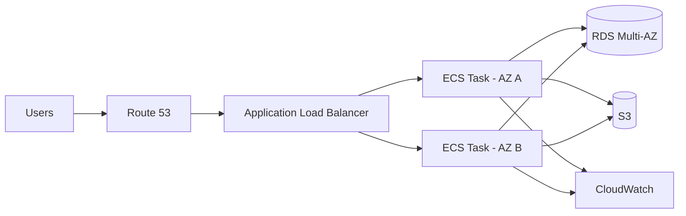

# AWS Reference Architecture

## Network Layout

- public subnets: ALB and NAT Gateway
- private application subnets: ECS tasks
- private database subnets: RDS
- security groups permit only necessary traffic between tiers
- secrets are stored in Secrets Manager or Parameter Store, not in source code

## Reliability Improvements

- at least two Availability Zones
- ECS desired count greater than one
- health checks and automatic replacement
- RDS Multi-AZ
- S3 versioning and encryption
- alarms for latency, errors and unhealthy targets
